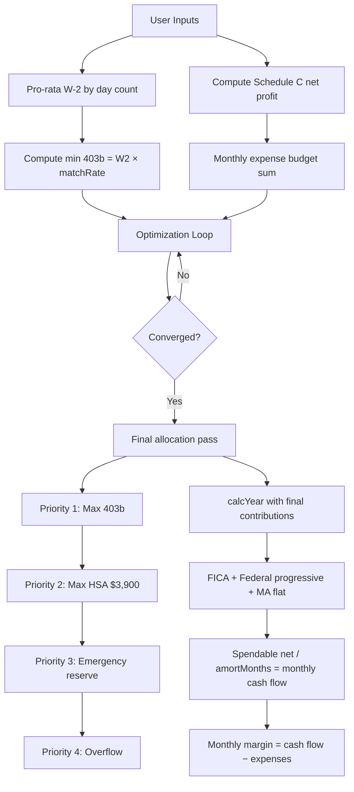

# HAEMR Residency Budget Calculator — Complete Algorithm Specification

**Academic Year:** 2026–27 (PGY-1 → PGY-2)
**Filing Status:** Single, independent filer
**State:** Massachusetts
**Source:** [budget.html](file:///Users/roshanlodha/Documents/roshanlodha.github.io/haemr/budget.html)

---

## 1. Hard-Coded Constants

These values are fixed in code and not adjustable by the user:

| Constant | Value | Notes |
|---|---|---|
| Days in year | **365** | Denominator for pro-rata salary |
| Days in 2026 (Y1) | **204** | July 11 → Jan 31 (partial first year) |
| Days PGY-1 in 2027 (Y2) | **161** | Jan 1 → Jun 10 (PGY-1 portion of Y2) |
| Days PGY-2 in 2027 (Y2) | **204** | Jun 11 → Dec 31 (PGY-2 portion of Y2) |
| Amortization months Y1 | **6.6** | Spread Y1 earnings over ~6.6 months |
| Amortization months Y2 | **12** | Full calendar year |
| Employee 403(b) annual max | **$24,500** | 2026 IRS limit |
| Meal card monthly | **$60** | Hospital meal card stipend |
| Hospital dinner perks monthly | **$40** | Evening meal allowance |
| Fitness reimbursement annual | **$150** | Gym/fitness subsidy |
| Bluebikes annual | **$73.50** | Bike-share membership |
| Education grant | **$375** | One-time textbook/access grant |
| Step 3 reimbursement max | **$5,250/yr** | Tuition/UWorld reimbursement cap |
| Conference travel max | **$1,200** | PGY-4 conference travel budget |
| MA personal exemption (single) | **$4,400** | Hard-coded inside `calcYear()` |

---

## 2. User Inputs (Defaults)

### 2a. Income

| Input | Default | Description |
|---|---|---|
| PGY-1 base salary | **$84,579/yr** | Annual W-2 salary |
| PGY-2 base salary | **$88,843/yr** | Annual W-2 salary |
| Housing/trainee stipend | **$10,500/yr** | Taxable lump-sum, ~$9k net after marginal tax |

### 2b. Retirement & Payroll

| Input | Default | Description |
|---|---|---|
| MGB match rate | **2%** | Employer 403(b) match rate |
| Monthly reserve cash | **$500/mo** | Target emergency fund contribution |
| Social Security rate | **6.2%** | Employee-side FICA |
| Medicare rate | **1.45%** | Employee-side FICA |
| Side income retirement plan | **Solo 401(k)** | Options: Solo 401(k) or SEP-IRA |
| Solo 401(k) employer contribution | **20%** | Applied to (Schedule C profit − ½ SE tax) |

### 2c. Tax Assumptions

| Input | Default | Description |
|---|---|---|
| Federal standard deduction | **$16,100** | 2026 standard deduction (single) |
| MA state tax rate | **5%** | Flat rate |
| MA deductible moving expenses | **$0** | 2026-only deduction |
| Federal tax brackets (JSON) | See below | Progressive bracket schedule |

**Federal Brackets:**

| Bracket ceiling (taxable $) | Marginal rate |
|---|---|
| $12,400 | 10% |
| $50,400 | 12% |
| $105,700 | 22% |
| $201,775 | 24% |
| $256,225 | 32% |
| $640,600 | 35% |
| ∞ | 37% |

### 2d. Monthly Expenses (Boston Projections)

| Category | Default $/mo | Cleveland historical $/mo |
|---|---|---|
| Rent & utilities | **$2,900.00** | $1,720.00 |
| Food (dining) | **$494.45** | $369.63 |
| Groceries | **$291.66** | $194.44 |
| Travel | **$100.00** | $381.12 |
| Transportation | **$45.00** | $361.51 |
| Clothes & hair | **$75.71** | $151.42 |
| Other | **$50.00** | $52.75 |
| Coffee | **$50.00** | $30.74 |
| Education | **$0.00** | $806.15 |
| Healthcare | **$22.00** | $0.00 |
| Supplemental Disability (IDI) | **$0.00** | $0.00 |
| **Total** | **$4,028.82** | $4,066.26 |

### 2e. Schedule C Inputs

| Input | Default | Description |
|---|---|---|
| Annual Schedule C revenue | **$7,500/yr** | Gross self-employment income |
| Monthly business expenses | **$50/mo** | → $600/yr annualized |
| Annual Schedule C deductible expenses | **$0/yr** | Direct deductions |
| Monthly tech/server costs | **$0/mo** | Net of $375 education grant |
| Home office sq ft | **0** | Simplified deduction = min($1,500, sqft × $5) |

---

## 3. Income Computation

### 3a. W-2 Pro-Rata Salary

Salary is prorated by day count, **not** by paycheck.

**2026 (Y1):**
```
W2_Y1 = PGY1_salary × (204 / 365) = $84,579 × 0.55890 = $47,270.63
```

**2027 (Y2) — blended:**
```
W2_Y2 = PGY1_salary × (161 / 365) + PGY2_salary × (204 / 365)
      = $84,579 × 0.44110 + $88,843 × 0.55890
      = $37,308.37 + $49,651.15
      = $86,959.52
```

### 3b. Schedule C Net Profit

```
techServerAnnual       = techServerCosts × 12 = $0
techServerDeductible   = max(0, techServerAnnual − $375) = $0
businessExpensesAnnual = $50 × 12 = $600
homeOfficeDeduction    = min($1,500, homeOfficeSqFt × $5) = $0

totalScheduleCExpenses = $0 + $0 + $0 + $600 = $600
scheduleCProfit        = max(0, $7,500 − $600) = $6,900
```

> [!NOTE]
> The $375 education grant is subtracted from tech/server costs before they become deductible, acting as a grant offset. If tech/server costs are $0, this offset has no effect.

### 3c. Gross Income

```
Gross_Y1 = W2_Y1 + stipend + scheduleCProfit = $47,270.63 + $10,500 + $6,900 = $64,670.63
Gross_Y2 = W2_Y2 + stipend + scheduleCProfit = $86,959.52 + $10,500 + $6,900 = $104,359.52
```

---

## 4. Tax Engine (`calcYear` Function)

The core tax function computes everything from FICA through take-home. Here are the exact formulas:

### 4a. FICA on W-2

```
SS_W2       = W2 × 6.2%
Medicare_W2 = W2 × 1.45%
FICA_W2     = SS_W2 + Medicare_W2
```

### 4b. Self-Employment Tax on Schedule C

```
seTaxableEarnings = scheduleCProfit × 0.9235        (92.35% factor per IRS)
SS_SE             = seTaxableEarnings × 12.4%        (both halves)
Medicare_SE       = seTaxableEarnings × 2.9%         (both halves)
seTax             = SS_SE + Medicare_SE
seTaxDeduction    = seTax / 2                         (above-the-line deduction)
```

### 4c. Side Retirement Contribution

```
sidePlanContributionBase = max(0, scheduleCProfit − seTaxDeduction)
sideRetirementContribution = sidePlanContributionBase × solo401kEmployerRate   (default 20%)
```

> [!IMPORTANT]
> This applies identically for both Solo 401(k) and SEP-IRA options. The code treats them the same way — the employer-side contribution rate is applied to (profit − ½ SE tax). There is no separate employee-side deferral modeled for the Solo 401(k).

### 4d. Adjusted Gross Income (AGI)

```
AGI = W2 + stipend + scheduleCProfit − retirement403b − seTaxDeduction − sideRetirementContribution − HSA
```

### 4e. Federal Tax

```
taxableFederalPreQBI = max(0, AGI − stdDeduction)
QBI_deduction        = (scheduleCProfit − seTaxDeduction − sideRetirementContribution) × 20%
taxableFederal       = max(0, taxableFederalPreQBI − QBI_deduction)
federalTax           = progressive_bracket_calculation(taxableFederal)
```

### 4f. Massachusetts State Tax

```
taxableState = max(0, AGI + HSA − $4,400_personal_exemption − movingExpenseDeduction)
stateTax     = taxableState × 5%
```

> [!WARNING]
> **HSA is added back** for MA state tax purposes. Massachusetts does not recognize HSA contributions as a state-level deduction. The code correctly adds HSA back to AGI before computing MA taxable income.

### 4g. Total Tax & Spendable Net

```
totalFICA    = FICA_W2 + seTax
totalTax     = totalFICA + federalTax + stateTax
spendableNet = W2 + stipend + scheduleCProfit − retirement403b − sideRetirementContribution − HSA − totalTax
amortizedMonthly = spendableNet / amortMonths
```

---

## 5. Retirement Optimization Algorithm

This is the core optimization loop. It iteratively maximizes tax-advantaged contributions within cash flow constraints.

### 5a. Priority Waterfall

The algorithm allocates surplus cash in strict priority order:

1. **Employee 403(b)** — maximize up to $24,500 annual cap
2. **HSA** — maximize up to $3,900 annual cap
3. **Emergency reserve** — up to (reserveCashMonthly × amortMonths)
4. **Overflow** — any remaining surplus is unallocated

### 5b. Iterative Convergence Loop

```
INPUTS:
  min403b = W2 × matchRate          (floor to capture employer match)
  maxExtra403b = $24,500 − min403b

INITIALIZE:
  recommended403b = min(24500, min403b)
  hsaContribution = 0
  extra403bContribution = 0

FOR i = 0 to 29:
  1. Compute full tax year with current (recommended403b, hsaContribution)
  2. annualAvailable = max(0, (amortizedMonthly − monthlyBudget) × amortMonths)
  3. totalSurplus = annualAvailable + extra403bContribution + hsaContribution
  4. Allocate:
     extra403bContribution = min(maxExtra403b, totalSurplus)
     remaining = totalSurplus − extra403bContribution
     hsaContribution = min($3,900, remaining)
  5. next403b = min($24,500, min403b + extra403bContribution)
  6. IF |next403b − recommended403b| < $0.50 → converged, BREAK
  7. recommended403b = next403b
```

> [!NOTE]
> The loop runs up to 30 iterations but typically converges in 3–5 iterations because each additional dollar of pretax contribution reduces taxes, freeing up more cash, which the loop re-allocates until stable.

### 5c. Post-Loop Final Allocation

After convergence, a final pass allocates remaining surplus:

```
annualAvailableFinal = max(0, (amortizedMonthly − monthlyBudget) × amortMonths)
totalSurplusFinal = annualAvailableFinal + extra403bContribution + hsaContribution

Priority 1: extra403b     = min(maxExtra403b, totalSurplusFinal)
Priority 2: HSA            = min($3,900, remaining)
Priority 3: reserve        = min(reserveCashMonthly × amortMonths, remaining)
Priority 4: overflow       = any leftover
```

### 5d. Employer Match (Non-Optimized)

The employer match is **not** part of the optimization loop. It is computed separately for display:

```
employerMatch = W2 × matchRate
```

This is a free contribution from MGB, counted in the total retirement KPI but not in the employee's cash flow.

---

## 6. Total Retirement KPI

The "Total Retirement Contribution" shown in the KPI section sums:

```
totalRetirement = employee403b + employerMatch + sideRetirementContribution + HSA
```

Where:
- `employee403b` = optimized 403(b) contribution (up to $24,500)
- `employerMatch` = W2 × 2% (employer pays, not from employee cash)
- `sideRetirementContribution` = Solo 401(k)/SEP-IRA employer-side from Schedule C
- `HSA` = optimized HSA (up to $3,900)

---

## 7. Benefits Modeled (Section 03)

These are reference benefits shown for context. **Most are NOT subtracted from expenses**:

| Benefit | Value | How modeled |
|---|---|---|
| Medical premium (HDHP) | $0/mo | Zero premium assumed |
| Employer HSA seed | $500/yr | Informational only, not added to cash flow |
| Healthcare budget | $22/mo | User input, covers dental/vision/OOP |
| 403(b) match | 2% of W-2 | Modeled in retirement section |
| Education fund | $0 | Not currently modeled as income offset |
| Meal card stipend | $60/mo | Listed as reference; **not** subtracted from food expenses |
| Hospital meal perks | $100/mo modeled | $60 card + $40 dinner; reference only |
| MBTA transit benefit | 50% discount pre-tax | Modeled as $45/mo transportation |
| Relocation stipend | $0 | No direct cash |
| Housing/childcare stipend | $10,500/yr | **Included** in gross income, fully taxed |
| Step 3 & UWorld / Tuition | Up to $5,250/yr | Reference only, not subtracted |
| Fitness subsidy | $150/yr | Reference only, not subtracted |
| Education grant | $375 one-time | Offsets tech/server costs in Schedule C |
| Travel & transit | Variable | $45 MBTA, $73.50 Bluebikes, $1,200 PGY-4 |

> [!IMPORTANT]
> **Zero-cost employer insurance perks** (not in budget math):
> - Core Long-Term Disability: 60% of salary up to $8,000/mo
> - Basic Life Insurance: 1× salary up to $500,000
> - Basic AD&D Insurance: 1× salary up to $500,000

---

## 8. Expense Comparison (Section 05)

Cleveland historical spending is stored as a static reference:

| Category | Cleveland | Boston (default) | Δ/month |
|---|---|---|---|
| Rent & utilities | $1,720.00 | $2,900.00 | +$1,180.00 |
| Food (dining) | $369.63 | $494.45 | +$124.82 |
| Groceries | $194.44 | $291.66 | +$97.22 |
| Travel | $381.12 | $100.00 | −$281.12 |
| Transportation | $361.51 | $45.00 | −$316.51 |
| Clothes & hair | $151.42 | $75.71 | −$75.71 |
| Other | $52.75 | $50.00 | −$2.75 |
| Coffee | $30.74 | $50.00 | +$19.26 |
| Education | $806.15 | $0.00 | −$806.15 |
| Healthcare | $0.00 | $22.00 | +$22.00 |
| Disability (IDI) | $0.00 | $0.00 | $0.00 |
| **Total** | **$4,066.26** | **$4,028.82** | **−$37.44** |

---

## 9. Schedule C Detail (Section 07)

The Schedule C section computes an **approximate** marginal tax on side income:

```
hobbyMarginalRate = 22% if taxableFederal > $48,475
                    12% if taxableFederal > $11,925
                    10% otherwise

scheduleCTax = scheduleCProfit × (hobbyMarginalRate + stateRate + 12.4% SS + 2.9% Medicare)
afterTaxBusinessCash = grossRevenue − totalDeductions − scheduleCTax
```

> [!WARNING]
> This is an approximation for display purposes. The actual federal tax on Schedule C income is already computed via the progressive bracket engine in `calcYear()`. This section provides a quick reference estimate but uses a simplified marginal rate lookup that may not perfectly align with the main tax computation.

---

## 10. Margin Analysis (Section 06)

Simple monthly margin:

```
monthlyMargin_Y1 = amortizedMonthlyCashFlow_Y1 − monthlyBudget
monthlyMargin_Y2 = amortizedMonthlyCashFlow_Y2 − monthlyBudget
```

This is the surplus **after** taxes, retirement contributions, and HSA have been deducted, compared against Boston projected expenses.

---

## 11. Key Design Decisions & Potential Issues for Review

### ✅ Things the algorithm does well:
1. **Iterative 403(b)/HSA optimization** — maximizes tax-advantaged space before allocating to reserves
2. **Correct SE tax handling** — 92.35% net earnings factor, above-the-line ½ SE tax deduction
3. **QBI deduction** — applies Section 199A 20% deduction to qualified business income
4. **MA HSA add-back** — correctly adds HSA back for Massachusetts tax since MA doesn't recognize HSA deductions
5. **Pro-rata salary by day count** — handles partial-year and blended-year salary accurately

### ⚠️ Items a financial advisor should verify:

1. **Federal bracket thresholds** — The default brackets ($12,400 / $50,400 / $105,700 / etc.) should be verified against the actual 2026 IRS tables for single filers. They appear to be 2025 values with slight adjustments.

2. **Standard deduction $16,100** — Verify this matches 2026 projected single-filer standard deduction.

3. **403(b) limit $24,500** — Verify this is the correct 2026 IRS elective deferral limit for under-50 filers.

4. **HSA limit $3,900** — The code uses $3,900 as the individual HSA max. Verify against 2026 IRS limits.

5. **Solo 401(k) modeling** — Only the employer-side contribution (20% of net earnings) is modeled. There is **no separate employee-side deferral** for the Solo 401(k). This may understate the total Solo 401(k) contribution capacity. The combined limit is typically $24,500 employee + 20% employer, subject to a total cap.

6. **Employer HSA seed of $500** — Listed as informational but **not added to cash flow** or the HSA contribution total. If the employer deposits $500, the personal HSA contribution cap should arguably be $3,900 − $500 = $3,400 to stay within the IRS limit.

7. **Stipend treatment** — The $10,500 housing stipend is treated as fully taxable ordinary income. This is correct if it's a cash stipend (not a qualified moving expense), but the advisor should confirm.

8. **MA moving expense deduction** — Defaults to $0. Massachusetts allows deduction of qualified moving expenses (unlike federal post-TCJA). If applicable, this could reduce MA state tax.

9. **No estimated tax / underpayment penalty modeling** — The calculator computes annual tax liability but does not model quarterly estimated payments or potential underpayment penalties on Schedule C income.

10. **Schedule C Section 07 marginal rate approximation** — Uses a simplified bracket lookup that may diverge from the actual progressive computation. This section is advisory, not used in the core math.

11. **Meal card / food perks not offsetting expenses** — The $60/mo meal card and $40/mo dinner perks are listed as reference items but **not** subtracted from the food budget. If these benefits genuinely reduce out-of-pocket food spending, the expense projection may be conservative (overstated).

12. **No Roth IRA / backdoor Roth modeling** — The calculator does not model Roth IRA contributions (traditional or backdoor). At these income levels, a backdoor Roth IRA may be available.

13. **Social Security wage base cap** — The code applies 6.2% SS tax to the full W-2 without checking against the Social Security wage base ($168,600 in 2025). At PGY-1/PGY-2 salary levels this isn't an issue, but the cap is not coded.

14. **No state-level business income deductions** — Massachusetts may offer additional deductions or credits for self-employment income not modeled here.

---

## 12. Algorithm Flow Summary (End-to-End)


